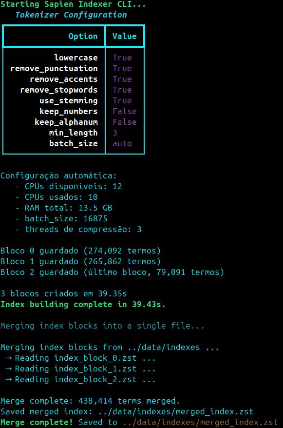

# "Vortex" - Search Engine Project

This project implements a search engine called "Vortex" with both a REST API for searching and a CLI interface for indexing. It's built with strict typing, linting, and memory constraints to ensure high-quality, efficient code.

<p align="center">
    
</p>

## Prerequisites

- uv (install from https://docs.astral.sh/uv/getting-started/installation/)

## Setup

1. Install dependencies:
   ```bash
   uv sync
   ```

2. You don't need to activate the environment manually. Just let `uv` handle the activation automatically by prefixing your commands with `uv run`.

3. Install pre-commit hooks (runs linting on every commit):
   ```bash
   uv run pre-commit install
   ```

## Project Organization

The project is organized into several key components:

```
src/sapien/
├── core/                   # Core models and utilities
│   ├── model.py            # Document data models (Pydantic)
│   ├── limit_memory.py     # Memory monitoring utilities
|   ├── logging.py          # Logging configuration
|   ├── corpus.py           # Corpus handling
|   ├── tokenizor.py        # Text tokenization utilities
|   ├── indexer.py          # Indexing logic
|   ├── merge_indexes.py    # Index merging utilities
|   └── searcher.py         # Search logic
├── entrypoints/            # Application entry points
│   ├── api/                # FastAPI REST API
│   │   ├── app.py          # FastAPI application setup
│   │   ├── model.py        # API request/response models
│   │   └── routes/         # API route handlers
│   │       ├── search.py      # Search endpoints
│   │       └── healthcheck.py # Health check endpoint
│   ├── cli.py            # Command-line indexer interface
│   └── asgi.py           # ASGI server entry point
static_pages/             # static webpage that interacts with your search engine via REST
```

### Key Entrypoints:

- **REST API**: FastAPI-based search interface accessible at `/api/v1/search/`
- **CLI Indexer**: Command-line tool for building search indices with memory limiting (≤2GB)

## Usage

### Running the Search API

Start the FastAPI server:
```bash
uv run uvicorn sapien.entrypoints.asgi:app --reload
```
- **Static Web Interface**: `http://localhost:8000`
- **API docs**: `http://localhost:8000/docs`

### Running the CLI Indexer

The CLI indexer runs with memory monitoring enabled to enforce the 2GB memory limit:
```bash
uv run cli [arguments]
```
OR
```bash
uv run src/sapien/entrypoints/cli [arguments]
```

Cli Arguments:

| Flag                   | Description                                                                 |
| ---------------------- | ---------------------------------------------------------------------------- |
| `--input`              | Path to `.arrow` file (Wikipedia corpus, required)                           |
| `--output`             | Directory where `.zst` index blocks will be stored (required)                |
| `--batch-size`         | Number of documents processed per batch (automatic by default)               |
| `--min-length`         | Minimum token length (e.g. ignore short words like “de”, “a”)                |
| `--lowercase`          | Converts all text to lowercase                                               |
| `--remove-punctuation` | Remove punctuation                                                           |
| `--remove-accents`     | Remove accents (e.g. “ação” → “acao”)                                        |
| `--remove-stopwords`   | Removes common Portuguese words (stopwords)                                  |
| `--use-stemming`       | Enables stemming (reduces “cities” → “cidad”)                                |
| `--keep-numbers`       | Keeps numbers as tokens                                                      |
| `--keep-alphanum`      | Holds alphanumeric tokens (e.g. “A1”, “x5b”)                                 |
| `--merge`              | Merges all index blocks into a single final alphabetically sorted index file |
| `--search`             | Run a search query on the merged index after building (e.g., 'Portugal').    |
| `--top-k`              | Number of top results to display for the search query.                       |
| `--monitor-memory`     | Shows memory consumption in real time                                        |
| `--verbose`            | Enables detailed logs (DEBUG, useful for testing and metrics)                |

**Note**: The CLI automatically starts memory monitoring, which must be included as part of the assignment.
Each group must be able to develop an indexer with memory constraints.

Example command to start the indexer (with merge in the end) and words normalized and stemmed:
```bash
uv run cli \
  --input ../data/ptwiki-small-50000.arrow \
  --output ../data/indexes \
  --lowercase \
  --remove-punctuation \
  --remove-accents \
  --remove-stopwords \
  --min-length 3 \
  --use-stemming \
  --merge \
  --verbose
```
Example of cli running:

<p align="center">
    
</p>

## Development Best Practices

### Code Quality

This project enforces strict code quality standards:

- **Type Checking**: Full type annotation coverage with Pyright
- **Linting**: Ruff with comprehensive rule set (100-char line limit)
- **Formatting**: Automatic code formatting with Ruff
- **Import Sorting**: Organized imports with isort integration

### Git Workflow

1. **Make frequent commits**: Pre-commit hooks run type checking and linting automatically
2. **Follow the enforced standards**: The project uses strict linting rules for consistency
3. **Test before committing**: All code is validated before entering the repository

### Skipping Pre-commit Hooks

⚠️ **NOT RECOMMENDED!**

This repository includes pre-commit hooks that verify and standardize code before committing. However, if you're close to a deadline and need to bypass them temporarily:

```bash
git commit --no-verify -m "Your commit message"
```

## Project team

<table>
  <tr>

<td align="center" width="50%;"></td>
    <td align="center"><a href="https://github.com/TiagoAlb12"><br /><sub><b>Tiago Albuquerque</b><br><i>112901</i></sub></a><hr><b>MEI</b><br><a href="https://github.com/TiagoAlb12" title="Code">💻</a><a href="https://github.com/TiagoAlb12" title="Tools">🔀</a><a href="https://github.com/TiagoAlb12" title="Tools">🔨</a></td>
    <td align="center"><a href="https://github.com/ttabelhaxd"><br /><sub><b>Abel Teixeira</b><br><i>113655</i></sub></a><hr><b>MEI</b><br><a href="https://github.com/ttabelhaxd" title="Code">💻</a><a href="https://github.com/ttabelhaxd" title="Design">🎨</a><a href="https://github.com/ttabelhaxd" title="Tools">🔧</a></td>

<td align="center" width="100px;"></td>
</tr>
</table>
